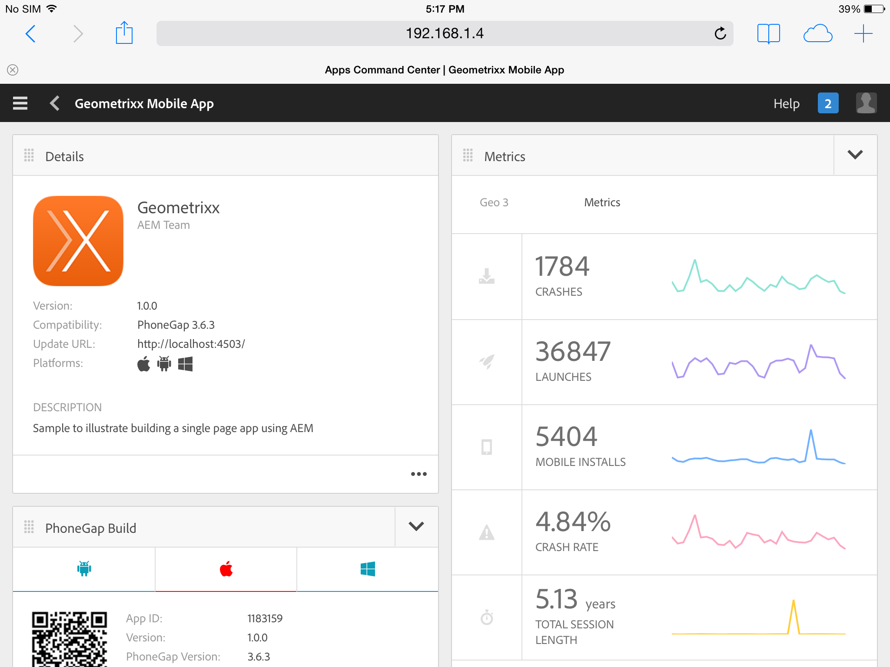

# AEM Apps

## History Slides

http://brucelefebvre.com/slides/connectwebex-aem-apps/#/3

From 'Mobile apps: Made and managed in AEM', originally presented at CONNECT Web Experience 2014.

## Feature Slides

http://brucelefebvre.com/slides/pgday-sf-2014-enterprise/#/12

From 'ENTERPRISE: Not just a dirty word any more', originally presented at PhoneGap Day SF 2014.

## Dashboard

Open up the dashboard (assumes an AEM instance running on `:4502`): [http://localhost:4502/aem/apps.html/content/phonegap](http://localhost:4502/aem/apps.html/content/phonegap)

Tap into Geometrixx Outdoors app to view the dashboard.

[Next →](../kitchen-sink)