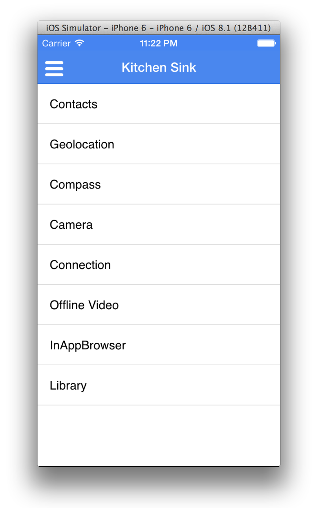

# Kitchen Sink

> A PhoneGap API showcase app managed in AEM



## Details

Please see the Kitchen Sink project repository README for details:

https://github.com/blefebvre/aem-phonegap-kitchen-sink

## View in AEM

Once installed, the app can be accessed and managed via the Command Center:

[http://localhost:4502/aem/apps.html/content/phonegap](http://localhost:4502/aem/apps.html/content/phonegap)

## Demo: Add a new component

Let's add a page that outputs details about the device.

#### Create the component

Create a copy of the `phonegap-connection` [component](http://localhost:4502/crx/de/index.jsp#/apps/brucelefebvre/kitchen-sink/components/phonegap-connection). It was chosen because of its similarity to the component we'll be building.

Rename your copied component to `phonegap-device`. Make sure to rename it's .jsp, clientlib .js file, and js.txt to match. The `svg` dir can also be removed.

#### Vault it out

Vault the new component out to our filesystem by checking out the project from AEM:

	cd content/src/main/content/jcr_root/
	vlt --credentials admin:admin checkout -f ../META-INF/vault/filter.xml --force http://localhost:4502/crx

Open up the aem-phonegap-kitchen-sink project with your editor of choice.

#### JavaScript 

Replace the existing JavaScript in `phonegap-device.js` with the follow self invoking function:

```
;(function (angular, window, undefined) {

    angular.module('phonegapDevice', ['btford.phonegap.ready'])
        .controller('DeviceCtrl', ['$scope', 'phonegapReady', 
            function ($scope, phonegapReady) {

                var getDeviceData = phonegapReady(function() {
                    $scope.device = window.device;
                });
                
                getDeviceData();
            }
        ]);

}(angular, window));
```

Add our new module to `ng-ionic-page/angular-module-list.js.html`:

```
,
'phonegapDevice'
```

#### HTML

Replace the existing HTML in `phonegap-device.jsp` with the following:

```
<%@include file="/libs/foundation/global.jsp" %><%
%><%@ page session="false" %><%
%>
<div ng-controller="DeviceCtrl" class="list">
	<label class="item item-input item-stacked-label">
		<span class="input-label">
			Platform
		</span>
		<input type="text" disabled ng-value="device.platform">
	</label>

	<label class="item item-input item-stacked-label">
		<span class="input-label">
			Model
		</span>
		<input type="text" disabled ng-value="device.model">
	</label>

	<label class="item item-input item-stacked-label">
		<span class="input-label">
			OS Version
		</span>
		<input type="text" disabled ng-value="device.version">
	</label>

	<label class="item item-input item-stacked-label">
		<span class="input-label">
			Cordova Version
		</span>
		<input type="text" disabled ng-value="device.cordova">
	</label>
</div>
```

Vault your changes in, or use `mvn -PautoInstallPackage clean install` to build and install the entire package.

#### Create a 'Device' page

We need a page to showcase our new component. Add a new page as a child of [home](http://localhost:4502/aem/apps.html/content/phonegap/kitchen-sink/en/home).

Select the 'Ionic PhoneGap Page', and name it 'Device'. Open the new page.

#### Add the Device component

Open the left rail, and tap the 'Components' tab. Drag and drop the new Device component onto the 'Drag components here' area of the page.

That's it! The app is now ready to be updated Over the Air with your new device page & component.

[Next →](../mobile-services)