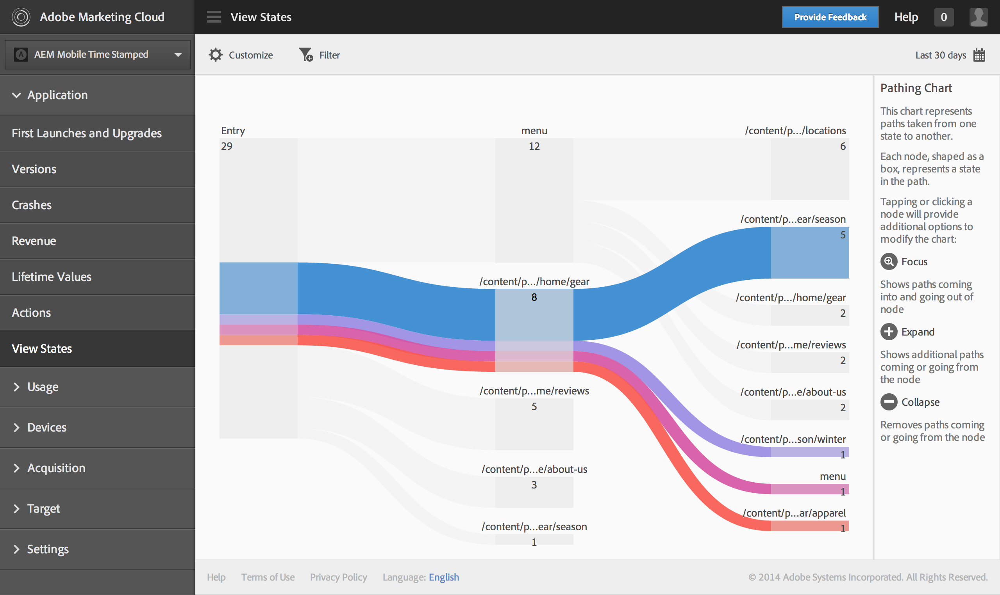
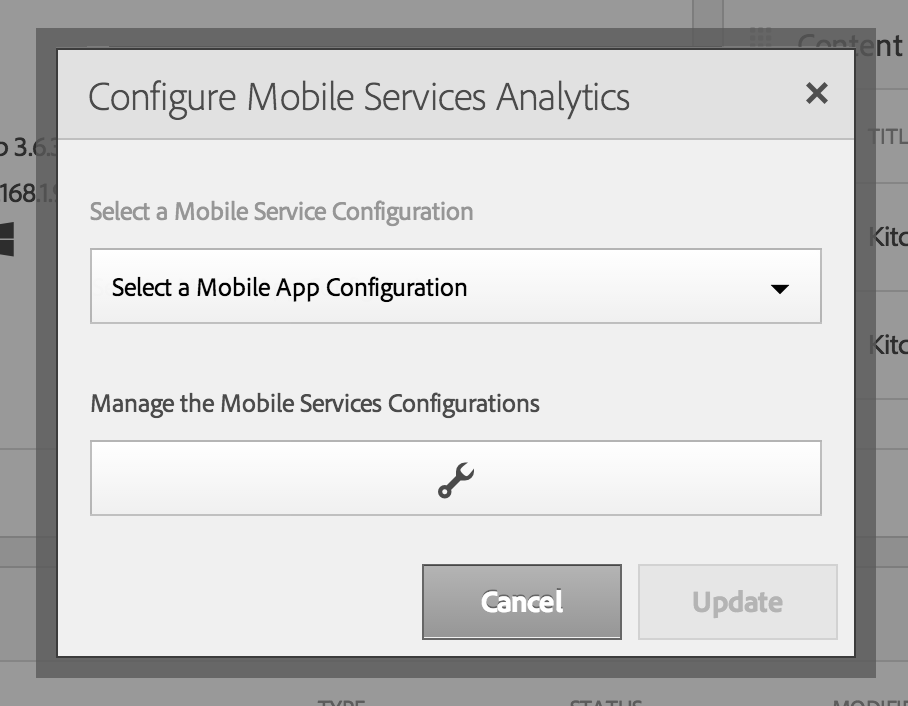
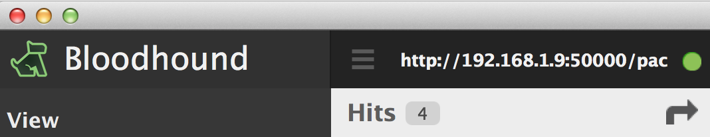
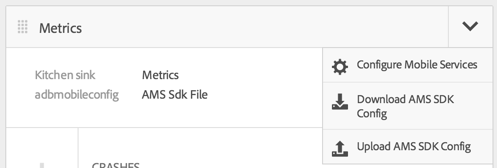

# Mobile Services

## Configure your app

From your app's Command Center, use the 'Metrics' tile to configure your Mobile Services account details:

Once configured, you will see the tile transform to provide an overview of key metrics tracked by your app (pictured above).

## Testing Analytics with Bloodhound

Testing with Bloodhound currently requires a tweak to `ADBMobileConfig.json`, before uploading to AEM.

From within Bloodhound, located your host details (towards the top left of the app):

Use this host and port to configure the `analytics.server` property value in `ADBMobileConfig.json`

Upload your modified config file to AEM via the 'Metrics' tile, 'Upload AMS SDK Config':

Your app is now ready to test. Any interaction with the app will now register as an 'event' in Bloodhound.

[Next →](../phonegap-build)